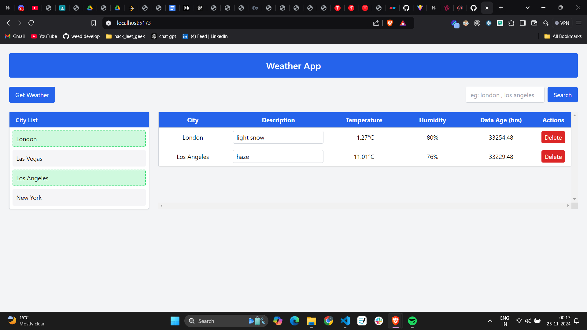

# Weather Dashboard Web App

## Description

This web app allows users to view weather details of various cities. Users can also search for weather details for a particular city. The app fetches real-time weather information from an API and displays it in a structured table format.

### Features:

- Display weather data of different cities in a table format.
- Allows users to search for the weather details of a particular city.
- Fetches weather information from an external API for the selected city.
- Displays the age of the data based on the time difference between the current time and the fetched data.
- Editable "Description" field for each city’s weather details.
- "Delete" functionality to remove weather data for a city from the details table.

---

## UI Layout Structure:

The layout consists of two main sections:

1. **City List Table (Single Column):**
   - A table with a single column displaying the list of cities.
   - The user can click on a city to fetch its weather data.
   
2. **Weather Details Table (6 Columns):**
   - A table with six columns: `City`, `Description`, `Temperature`, `Humidity`, `Date/Time`, and `Data Age (in hours)`.
   - The weather data for each city will be displayed here once fetched.
   - The `Description` column is editable by the user.

### Styling:

- **Header and Button Background Color:** `#4472C4`
- **Header and Button Text Color:** `#ffffff`
- **Row Content Text Color:** `#000000`
- **Row Border Color:** `#000000`
- **Highlight Color for Selected City (City List):** Green border around the selected city.

---

## User Interaction and Flow:

1. **Get Weather Button:**
   - The user clicks the **"Get Weather"** button.
   - The web app highlights the first row in the "City List" table with a green border.
   - The app then fetches weather data for that city from the following API:
     - **Method:** GET
     - **URL:** `https://python3-dot-parul-arena-2.appspot.com/test?cityname=<city name>`
     - Example: `https://python3-dot-parul-arena-2.appspot.com/test?cityname=London`
   
2. **Weather Information Fetching:**
   - Once the weather data is fetched, the web app adds a new row in the "Weather Details" table.
   - The new row contains the city name, description, temperature, humidity, current date/time, and the data age (calculated as the time difference between the current time and the data fetch time in hours).
   - After the first city's data is fetched, the next city in the list is highlighted, and the process repeats.

3. **Search:**
   - The user can enter a city name in the search input box and click the **"Search"** button.
   - If the city is found in the "Weather Details" table, the corresponding row will be highlighted in yellow.

4. **Delete Row:**
   - The user can delete any row in the "Weather Details" table by clicking the **"Delete"** button associated with the respective row.

---


## Additional Functionality:

- The app stores the weather data in a **JavaScript object (dictionary)** as new rows are added to the "Weather Details" table.
- The **"Description"** field in the table is editable by the user.
- The **"Data Age"** is calculated based on the difference between the current date and time and the data retrieval timestamp, and it is expressed in hours.

---

## Technologies Used:

- **Frontend:** React.js (for building the user interface)
- **Backend API:** Python (fetching weather data from the external API)
- **Styling:** Tailwind CSS (for styling the components)

---

## How to Run:

1. Clone this repository to your local machine.
   
   ```bash
   git clone  git@github.com:Sainkee/weather-in-react.git
2. Install the required dependencies:
   
   ```bash
   npm i
3. Start the development server:
   
   ```bash
   npm run dev
